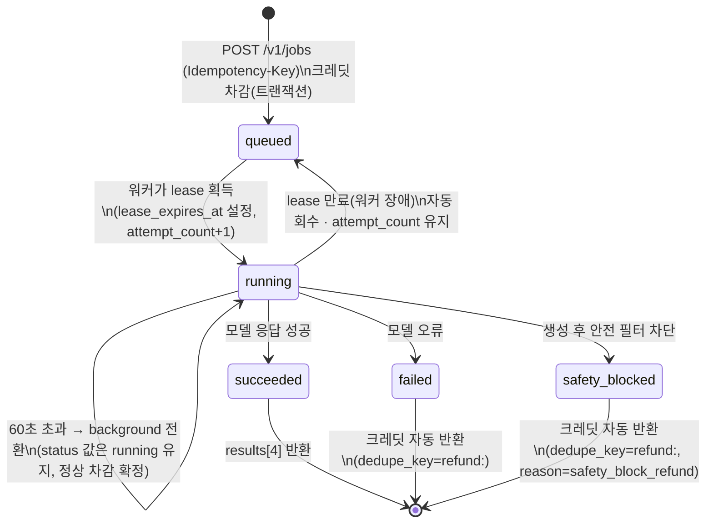
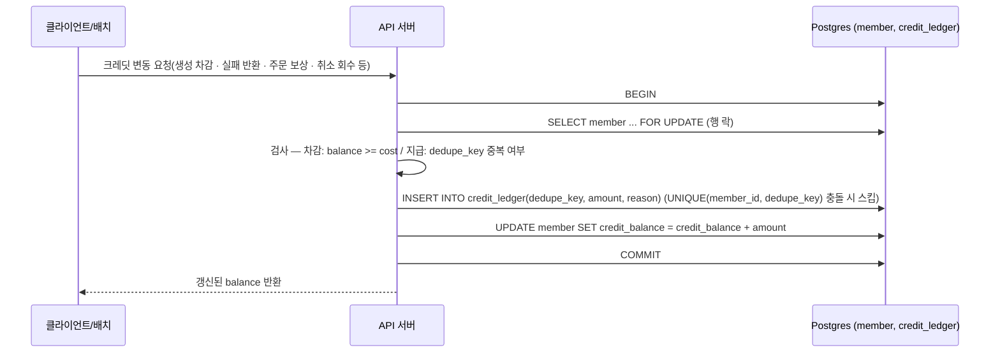

# 03. 유스케이스 명세

> 기준: wireframe-spec v0.5 / cebb865

## 0. 액터

| 액터 | 정의 |
|---|---|
| **게스트** | 비로그인 사용자. `member.kind='guest'`로 통합 관리(별도 게스트 테이블 없음). 게스트 JWT로 회원과 동일한 API를 사용 |
| **회원** | 카페24 쇼핑몰 계정으로 연동 완료한 사용자. 별도 회원 DB 없이 카페24 계정이 곧 이 서비스의 계정 |
| **관리자** | W-11 프롬프트 운영 콘솔 접근 권한을 가진 내부 운영자 |
| **시스템** | 비동기 워커(생성 job 처리), 카페24 주문 동기화 배치, 크레딧 정산 배치 등 사람이 직접 트리거하지 않는 처리 주체 |

---

## 1. 핵심 플로우 UC (6단계 · [#flow](wireframe-spec-v0.5.html#flow))

와이어프레임 스펙의 "핵심 플로우"(랜딩 → 스타일 선택 → 업로드 → 생성 → 결과 → 3갈래 출구) 각 단계를 UC로 정의합니다.

### UC-01 · 랜딩 진입 ([#p01](wireframe-spec-v0.5.html#p01))

- **액터**: 게스트, 회원
- **사전조건**: 없음(첫 진입)
- **사후조건**: 게스트 세션(`POST /v1/auth/guest`) 존재, 사용자가 UC-02로 이동
- **주 흐름**
  1. 사용자가 랜딩 페이지 접속. before/after 비교 슬라이더와 인기 스타일 프리뷰(모바일 3장/데스크톱 5장) 노출.
  2. 사용자가 주 CTA "사진 올리고 무료로 1장 만들기" 탭.
  3. UC-02(스타일 선택)로 진입.
- **대안 흐름**
  - A1: "전체 →" 탭 → 스타일 카드 없이 바로 W-02 카탈로그 진입.
  - A2: 로그인 칩 탭 → 카페24 로그인 → UC-07(게스트→회원 병합) 트리거(드문 경로, 통상은 W-06에서 발생).

### UC-02 · 스타일 선택 ([#p02](wireframe-spec-v0.5.html#p02), [#p03](wireframe-spec-v0.5.html#p03))

- **액터**: 게스트, 회원
- **사전조건**: 게스트 세션 존재
- **사후조건**: `style_id` 확정
- **주 흐름**
  1. `GET /v1/styles` 카탈로그 조회, 섹션 구획 + sticky 앵커바로 표시(검색 없음).
  2. 사용자가 스타일 카드 탭 → 바텀시트(W-03) 오픈, `GET /v1/styles/{id}` 상세 조회(예시 캐러셀 6장, 적합도 태그, 평균 소요시간).
  3. "이 스타일로 만들기" 탭 → 선택한 `style_id`를 들고 UC-03(업로드)으로 진입.
- **대안 흐름**: 없음(이 단계에 해당하는 엣지 케이스 없음).

### UC-03 · 사진 업로드 · 품질 체크 ([#p04](wireframe-spec-v0.5.html#p04))

- **액터**: 게스트, 회원
- **사전조건**: `style_id` 확정
- **사후조건**: `upload_id` 확정(정상 진행 시)
- **주 흐름**
  1. 저장된 펫 프로필이 있으면 목록 노출(`GET /v1/pets`), 선택 시 업로드 단계 스킵.
  2. 사용자가 새 사진 업로드.
  3. `POST /v1/uploads` → 품질 체크(흐림/저조도/다중 피사체) + 견종 추정 수행.
  4. 경고 없으면 즉시, 경고 있으면 W-04 B 경고 화면 표시 — **진행 버튼은 항상 활성**(비차단).
  5. "이대로 만들기 · 1 크레딧" 탭 → UC-04(생성)로 진입.
- **대안 흐름**(엣지 매핑)
  - **A1 = FR-EDGE-06 (사람 얼굴 포함 사진, P0)**: `human_face_policy` 설정값(`block`/`warn`/`allow`)에 따라 분기 — `warn`이면 경고 후 진행 허용, `block`이면 업로드 자체를 거부(UC-04로 진입 불가), `allow`이면 경고 없이 통과.
  - A2 = FR-EDGE-07 (고양이 사진 업로드, P1): "강아지 전용" 부드러운 안내와 함께 진행 차단, 미차감.
  - A3 = FR-EDGE-08 (강아지가 없는 사진, P1): 업로드 단계에서 감지·경고만, 진행은 허용(정상 차감).
  - A4 = FR-EDGE-09 (여러 마리가 찍힌 사진, P1): 대상 선택 UI 또는 "함께 변환" 안내 후 정상 진행.

### UC-04 · 이미지 생성 ([#p04](wireframe-spec-v0.5.html#p04), [#p05](wireframe-spec-v0.5.html#p05))

- **액터**: 게스트, 회원, 시스템(워커)
- **사전조건**: `upload_id`, `style_id` 확정, 크레딧 `balance >= cost`
- **사후조건**: `generation_job.status = succeeded`, `results[4]` 존재
- **주 흐름**
  1. 클라이언트가 `POST /v1/jobs`(헤더 `Idempotency-Key`) 호출 → 크레딧 차감 트랜잭션(§3 참고) → 202, `status: queued`.
  2. 워커가 job의 lease를 획득 → `status: running`.
  3. 클라이언트는 `GET /v1/jobs/{id}`를 2초 간격 지수 백오프로 폴링.
  4. 완료 시 `status: succeeded`, `results[4]` 반환 → UC-05(결과 확인)로 진입.
- **대안 흐름**(엣지 매핑)
  - **A1 = FR-EDGE-03 (크레딧 부족, P0)**: `POST /v1/jobs` 이전(또는 응답)에서 잔액 부족 감지 → job을 만들지 않고 "크레딧 받기" 시트를 인라인 오버레이로 표시(UC-09 재사용, 주문 보상이 최상단) → 크레딧 획득 후 **동일 Idempotency-Key로 재시도**.
  - **A2 = FR-EDGE-01 (생성 실패 · 모델 오류, P0)**: `running → failed`, 크레딧 자동 반환(`credit_ledger.dedupe_key = refund:<job_uuid>`), 실패 안내 + 재시도 버튼 노출, 원본 이미지는 유지.
  - **A3 = FR-EDGE-02 (타임아웃 60초 초과, P0)**: `running`이 60초를 넘기면 `background`로 전환(상태값은 유지, 정상 차감 확정) — 사용자는 "알림 받고 나가기"로 이탈 가능, 서버는 계속 처리하고 재방문 시 동일 `job_id`로 상태 복원(§2 상태머신 참고).
  - A4 = FR-EDGE-13 (부적절한 커스텀 프롬프트, P0, W-08 경유): 커스텀 프롬프트 생성 시에만 해당 — 상세 흐름은 UC-08.

### UC-05 · 결과 확인 ([#p06](wireframe-spec-v0.5.html#p06))

- **액터**: 게스트, 회원
- **사전조건**: `generation_job.status = succeeded`
- **사후조건**: `selected_index` 확정
- **주 흐름**
  1. `GET /v1/jobs/{id}`로 결과 4장 노출 — 비교 슬라이더 + 우하단 누띠 서명(제거 불가).
  2. 사용자가 썸네일 중 하나 선택 → `POST /v1/jobs/{id}/select`.
  3. 결과 확인 후 UC-06(출구 선택)으로 이동.
- **대안 흐름**
  - A1: 게스트가 저장을 시도 → W-06 B 계정 연동 바텀시트 노출 → UC-07(게스트→회원 병합) 트리거.

### UC-06 · 출구 선택 — 공유 · 쇼핑몰 · 계산기 ([#p06](wireframe-spec-v0.5.html#p06), [#p07](wireframe-spec-v0.5.html#p07))

세 출구는 배타적이지 않은 병렬 선택지입니다(우열이 아니라 취향). 화면 위계만 공유가 최상단.

- **액터**: 게스트, 회원
- **사전조건**: 결과 확인 완료(UC-05)
- **사후조건**: 클릭한 출구가 `metric_event` + GA4 이벤트로 기록됨
- **주 흐름**
  - (a) 공유: "인스타 공유" 탭 → `POST /v1/jobs/{id}/share` → 공유용 이미지 URL(서명 포함) 반환.
  - (b) 쇼핑몰: 쇼핑몰 배너 탭 → nutti.co.kr로 이동(정적 링크), 클릭 이벤트 기록.
  - (c) 계산기: 계산기 배너 탭 → `GET /v1/calculator-link` → 프리필된 `calculator.html`로 이동.
- **대안 흐름**(엣지 매핑, 계산기 출구에 한정)
  - A1 = FR-EDGE-10 (견종 추정 실패 · 믹스견, P1): `breed_code`를 비운 채 반환 → 계산기 1단계부터 시작.
  - A2 = FR-EDGE-11 (추정 견종이 계산기 42종 목록에 없음, P1): "믹스견"으로 폴백(계약: `07-decisions.md#Q9`).
  - A3 = FR-EDGE-12 (비로그인 상태에서 이탈, P1): 세션 토큰으로 결과 24시간 보존, 재방문 시 `GET /v1/jobs/{id}`로 복원(완료 알림 MVP 제외의 대체 경로 — 근거 `07-decisions.md#Q7`).

---

## 2. generation_job 상태머신

- **queued → running**: 워커가 Postgres `FOR UPDATE SKIP LOCKED` 큐에서 job을 집어 `lease_expires_at`을 설정.
- **running → queued (lease 회수)**: 워커가 죽거나 `lease_expires_at`을 넘기면 다른 워커가 같은 job을 재시도(`attempt_count` 증가). 무한 재시도 방지 임계는 구현 시 결정.
- **background 전환(FR-EDGE-02)**: 60초를 넘겨도 실패가 아니라 "진행 중"이 이어지는 것 — 클라이언트 UX만 백그라운드 모드로 바뀌고 서버 상태값은 `running`을 유지. 완료되면 `succeeded`/`failed`로 정상 전이.
- **failed(FR-EDGE-01) / safety_blocked(FR-EDGE-13)**: 둘 다 크레딧을 즉시 자동 반환. `dedupe_key`가 다르면 (`job:<uuid>` 최초 차감과 `refund:<uuid>` 반환) 별개 원장 행이므로 중복 반환은 발생하지 않음. 위 상태머신은 개념 모델이며, DB 저장값은 `status='failed'` + `error_code='SAFETY_BLOCKED'`로 압축 표현됨([04-erd.md](04-erd.md) §2.6 상태 모델링 노트).

---

## 3. 크레딧 트랜잭션 4단계 시퀀스

모든 크레딧 증감(차감/반환/지급/회수)이 공통으로 따르는 절차입니다.

- **락(SELECT FOR UPDATE)**: 동시 요청(예: 생성 2건 동시 클릭)이 잔액을 이중으로 읽지 못하게 함.
- **검사**: 차감은 `balance >= cost`, 지급/반환은 `dedupe_key` 중복 여부(같은 사유로 두 번 지급되지 않도록).
- **원장 INSERT**: `credit_ledger`가 진실. `dedupe_key` 값 규약 — `guest_trial` / `link_account` / `follow_ig` / `daily:<date>` / `order:<order_id>` / `clawback:<order_id>` / `job:<uuid>` / `refund:<uuid>`.
- **캐시 UPDATE**: `member.credit_balance`는 같은 트랜잭션에서 갱신되는 조회용 캐시. **음수 잔액을 허용**(클램프하지 않음) — 표시는 `max(0, balance)`, 차감 판정은 `balance >= cost`. 회수(clawback)로 잔액이 음수가 되어도 다음 지급이 자동 상환하므로 별도 처리 불필요.

---

## 4. UC-07 · 게스트 → 회원 병합

> 재방문 로그인이 **기본 경로**입니다 — 신규 가입이 예외가 아니라 "기존 회원 행이 없을 때"로 처리됩니다.

- **액터**: 게스트, 회원, 시스템
- **출처**: [#arch](wireframe-spec-v0.5.html#arch), [07-decisions.md](07-decisions.md) ADR-03
- **사전조건**: 게스트 세션 존재, 사용자가 로그인 액션 트리거(주로 W-06 B 계정 연동 바텀시트)
- **사후조건**: 게스트 자산이 회원 계정에 귀속, 게스트 토큰은 더 이상 유효하지 않음
- **주 흐름**
  1. "누띠 쇼핑몰 계정으로 로그인" 탭 → `GET /v1/auth/cafe24/authorize` → 카페24 로그인 → `GET /v1/auth/cafe24/callback`.
  2. 서버가 콜백된 카페24 회원 ID로 기존 `member` 행 존재 여부를 조회.
  3. **분기 A(기존 회원 행 있음 = 재방문)**: 게스트 세션의 자산(`pet`, `source_image`, `job`, `custom_prompt_log`, `metric_event`)을 기존 회원 행으로 이관하고, 게스트 행에 `merged_into_id`를 기록. 게스트 시절 받은 `guest_trial` 크레딧은 기존 회원이 이미 수령했다면 `dedupe_key` 충돌로 **INSERT 스킵**(무료 1장 반복 수령 방지).
  4. **분기 B(기존 회원 행 없음 = 신규 가입)**: 게스트 행의 `kind`를 `guest → member`로 전환(자산 이관 불필요, 같은 행을 그대로 승격).
  5. 회원 JWT 발급 → 클라이언트가 게스트 토큰을 교체.
  6. `link_account` 크레딧(+3, 최초 1회) 지급(`dedupe_key = link_account`).
- **대안 흐름**
  - A1: 카카오 로그인("카카오로 계속하기") 선택 시에도 동일 병합 로직 적용. 카카오는 보조 로그인이며, 주문 보상(+20) 수령 시점에는 쇼핑몰 계정 연동이 추가로 요구됨(`07-decisions.md#Q8`).

---

## 5. UC-08 · 커스텀 프롬프트 생성 (크리에이티브 모드, W-08)

- **액터**: 게스트, 회원
- **출처**: [#p08](wireframe-spec-v0.5.html#p08)
- **사전조건**: 탭바 "만들기" 내 보조 진입점에서 크리에이티브 모드 진입(기본 카탈로그와 분리)
- **사후조건**: `custom_prompt_log`에 입력 문구 저장(빈도 집계로 W-11 프리셋 승격 후보 제공)
- **주 흐름**
  1. 문장 틀("우리 애를 __ 로 만들어줘") + 예시 칩 노출, 예시 칩 클릭 시 자동 채움.
  2. 사용자 입력 → **입력 단계 필터**(품종/털색 변경 요청 감지 시 차단 안내).
  3. "만들기 · 2 크레딧" 탭 → `POST /v1/jobs`(`custom_prompt` 필드, `cost=2`).
  4. UC-04와 동일한 생성 흐름 진행 — 단, **생성 후 안전 필터 2차 검사**를 추가로 통과해야 함(브랜드 서명이 붙으므로 프리셋 스타일보다 엄격).
  5. 안전 필터 통과 시 `succeeded`, UC-05(결과 확인)로 이동.
- **대안 흐름**
  - **A1 = FR-EDGE-13 (부적절한 커스텀 프롬프트, P0)**: 2중 방어.
    - (a) **입력 단계 필터가 선차단**하면 생성 자체가 시작되지 않음 — 크레딧 미차감.
    - (b) 입력 단계는 통과했으나 **생성 후 안전 필터가 차단**하면 safety_blocked 상태(DB: `status='failed'` + `error_code='SAFETY_BLOCKED'`), 크레딧 자동 반환(`dedupe_key = refund:<job_uuid>`, `reason = safety_block_refund`) — §2 상태머신 참고.

---

## 6. UC-09 · 크레딧 획득 (W-10, 4경로)

- **액터**: 회원(전 경로), 시스템(주문 동기화 배치)
- **출처**: [#p10](wireframe-spec-v0.5.html#p10)
- **사전조건**: 경로별로 상이(아래 참고)
- **사후조건**: `credit_ledger` 기록 + `member.credit_balance` 갱신(§3 크레딧 트랜잭션 4단계 준수)
- **주 흐름 — 4개 획득 경로**
  1. **주문 보상(+20, best)**: 시스템이 카페24 Admin API로 주문을 배치 동기화(**워터마크** `last_synced_at` 기준으로 이전 재조회 이후 신규 주문만 조회). **컷오프**(`order_reward_cutoff`, 서비스 연동 시점) 이후 발생한 주문만 보상 자격. 자격 확인되면 자동으로 `credit_ledger` INSERT(`dedupe_key = order:<order_id>`) + 캐시 UPDATE — 수동 인증 불필요.
  2. **쇼핑몰 계정 연동(+3, 최초 1회)**: UC-07 로그인 완료 시 자동 지급.
  3. **인스타 팔로우(+2, 1회 한정)**: 사용자가 "받기" 탭 → `POST /v1/credits/claim`(`action=follow_ig`) → API가 팔로우 여부를 검증하지 않으므로 자율 신고 기반 지급.
  4. **오늘의 무료(+1, 매일 자정)**: 사용자가 "받기" 탭 → `POST /v1/credits/claim`(`action=daily`) → `dedupe_key = daily:<date>`로 하루 1회 제한.
- **대안 흐름**(엣지 매핑)
  - **A1 = FR-EDGE-05 (주문 보상 후 주문 취소, P0)**: 취소 감지(동기화 배치) → +20 **전액 회수**(`dedupe_key = clawback:<order_id>`). **음수 잔액 허용** — 표시는 `max(0, balance)`, 차감 판정은 `balance >= cost`. 다음 지급이 자동으로 음수를 상환하므로 재범(보상 받고 취소를 반복)이 구조적으로 차단됨(`07-decisions.md#Q3`).
  - **A2 = FR-EDGE-04 (카페24 토큰 만료, P0)**: 토큰 갱신 실패 시 주문 동기화 배치가 지급을 **보류**(워터마크 진행 정지)하고 관리자에게 알림. 갱신 성공 후 정지된 워터마크 지점부터 소급 재조회하여 누락분을 지급 — 사용자에게는 조용히 멈췄다가 복구되는 형태.

---

## 7. 커버리지 확인

- **핵심 플로우 6단계** — UC-01(랜딩) · UC-02(스타일 선택) · UC-03(업로드) · UC-04(생성) · UC-05(결과) · UC-06(출구 선택) 전건 정의됨.
- **P0 엣지 7건**(02-requirements.md 기준) 전건 소재 지정: FR-EDGE-01→UC-04 A2 · FR-EDGE-02→UC-04 A3 · FR-EDGE-03→UC-04 A1 · FR-EDGE-04→UC-09 A2 · FR-EDGE-05→UC-09 A1 · FR-EDGE-06→UC-03 A1 · FR-EDGE-13→UC-08 A1.
- **P1 엣지 6건** 전건 소재 지정: FR-EDGE-07→UC-03 A2 · FR-EDGE-08→UC-03 A3 · FR-EDGE-09→UC-03 A4 · FR-EDGE-10→UC-06 A1 · FR-EDGE-11→UC-06 A2 · FR-EDGE-12→UC-06 A3.
- **13건 엣지 전건**이 대안 흐름으로 소재가 지정되어 빈칸이 없다.
- **generation_job 상태머신**에 실패(`failed`)·타임아웃(`running`의 background 전환)·백그라운드 처리 전건 포함됨(§2).
