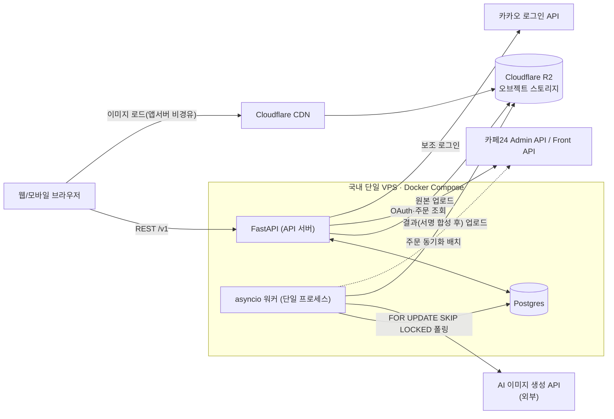

# 06. 아키텍처 · 배포

> 기준: wireframe-spec v0.5 / cebb865

이 문서는 시스템 구성, 비동기 생성 파이프라인, 배포 옵션, 카페24 연동, 운영(백업·모니터링)을 다룹니다. 화면-API 매핑은 [05-api-spec.md](05-api-spec.md), 데이터 모델은 [04-erd.md](04-erd.md)를 참고하세요.

---

## 1. 컴포넌트 구성도



**설계 근거**: 앱 서버(FastAPI)와 워커(asyncio)는 같은 VPS의 Docker Compose 서비스로 배치해 구성 요소 수를 최소화합니다(1인 운영 전제). 이미지는 R2에 저장하고 **사용자는 CDN에서 직접 읽습니다** — 앱 서버가 이미지 바이트를 중계하지 않으므로 서비스가 성공(=많이 퍼짐)할수록 앱 서버 부하가 느는 구조를 피합니다.

---

## 2. 비동기 생성 파이프라인

### 2.1 큐 = Postgres `FOR UPDATE SKIP LOCKED`

Redis/arq 없이 `generation_job` 테이블 자체를 큐로 씁니다. 동시 생성 작업이 수십 건 수준에서는 별도 큐 시스템이 "관리할 컴포넌트 하나 추가"에 불과합니다.

**폴링 쿼리(코드베이스에서 raw SQL을 쓰는 유일한 지점)**:

```sql
SELECT * FROM generation_job
WHERE status = 'queued'
   OR (status = 'processing' AND lease_expires_at < now())
ORDER BY queued_at
FOR UPDATE SKIP LOCKED
LIMIT 1;
```

- **Tortoise ORM 버전 의존 명시**: Tortoise ORM의 쿼리셋 API(`.select_for_update()`)가 `SKIP LOCKED`를 직접 지원하는지는 도입 시점의 버전에 따라 다릅니다. 지원하지 않으면 위 쿼리를 `Tortoise.get_connection("default").execute_query()`로 raw SQL 실행합니다. 스캐폴딩 착수 시 실제 버전에서 지원 여부를 먼저 확인하고, 지원되면 raw SQL을 ORM 호출로 대체합니다. **이 쿼리 하나를 제외한 나머지 전 코드는 Tortoise ORM 쿼리셋을 사용합니다** — raw SQL 사용을 이 지점으로 한정하는 것이 규칙입니다.

### 2.2 lease·재시도

- 워커가 job을 집으면 `status='processing'`, `lease_expires_at = now() + interval '90 seconds'`(20~40초 목표 대비 여유), `attempt_count += 1`로 갱신합니다.
- 워커 프로세스가 크래시해 lease가 갱신되지 못하면, `lease_expires_at`이 지난 job은 위 폴링 쿼리 조건(`status='processing' AND lease_expires_at < now()`)에 다시 걸려 다른 폴링 사이클이 회수합니다(가시성 타임아웃 패턴).
- `attempt_count`가 임계치(예: 3회)를 넘으면 `status='failed'`, `error_code='max_retries_exceeded'`로 종료하고 크레딧을 자동 반환합니다(엣지 표 "생성 실패" 처리와 동일 경로).

### 2.3 4장 동시 생성

W-03 "평균 24초 · 4장 생성" 목표를 맞추기 위해, 워커는 4장의 프로바이더 요청을 순차가 아니라 `asyncio.gather`로 **동시 발행**합니다. 단일 asyncio 프로세스라도 I/O 바운드(외부 API 호출 대기) 작업이므로 동시성에 문제가 없고, 전체 소요 시간이 "4장 순차 합"이 아니라 "가장 느린 1장" 수준에 수렴합니다.

### 2.4 arq 승격 임계 (3건 중 1건이라도 충족 시 검토)

1. 워커 크래시 후 lease 만료로 재처리되는 job 비율이 **일 1% 초과**가 1주일 이상 지속(직접 구현한 재시도 로직의 신뢰성 한계로 판단).
2. 폴링 지연(`queued_at` → job 실제 시작 시각)의 P95가 **10초 초과**가 지속 — 폴링 주기·인덱스 튜닝으로 해소되지 않는 경우.
3. 워커를 **여러 프로세스/여러 서버로 스케일 아웃**해야 하는 시점 — 단일 asyncio 프로세스로는 동시 처리량 한계에 도달했을 때. arq는 Redis 기반 분산 큐라 여러 워커 인스턴스 조율이 기본 제공됩니다.

이 중 하나라도 충족하면 `generation_job` 폴링을 arq(Redis 백엔드) 큐로 승격합니다. 지금은 만들지 않습니다(YAGNI).

---

## 3. AI 프로바이더 비교 (Q4 결정 전제 데이터)

Q4("1회 생성 4장이 원가상 가능한가")의 판단 근거입니다. "내 강아지 특징 보존"은 리서치 인사이트6(`wireframe-spec-v0.5.html#p00`)이 요구하는 핵심 품질 기준입니다.

| 프로바이더 | 장당 단가(1024px 기준) | 평균 지연(추정) | 상업적 이용 | "내 강아지" 특징 보존 | 비고 |
|---|---|---|---|---|---|
| **Gemini 2.5 Flash Image (Nano Banana)** | ~$0.039/장 | 수 초~10초대(공개 벤치마크 기준, 자체 검증 필요) | 가능(유료 API) | 정체성 보존이 모델의 핵심 강점으로 알려짐 — 유력 1순위 후보 | **2026-10-02 단종 예정** — 후속 모델로 교체 필요, 착수 직전 재확인 필수 |
| **GPT Image 1.5 / mini** | mini $0.005~0.052/장, 1.5 $0.009~0.20/장(품질·해상도 티어별) | 10~20초대(품질 티어에 따라 변동) | 가능(유료 API) | 전반적 품질은 높으나 얼굴 세부(무늬·표정) 변형이 상대적으로 큰 사례 보고됨 — 파일럿 필요 | GPT Image 1(구모델)은 2026-10-23 단종, 신규 구축은 1.5/mini 기준 |
| **Flux Kontext (BFL) Pro/Max** | Pro $0.04/장, Max $0.08/장(해상도 무관 정액) | 수 초대(Pro가 속도 최적화 티어) | 가능(pay-per-image, Replicate/fal.ai 등 API 경유 포함) | 캐릭터 일관성 편집(Kontext) 전용 설계 — 정체성 보존 우수 사례 다수 | 입력 이미지도 과금 대상(출력만이 아님) — 원가 계산 시 반영 필요 |

**Q4 원가 계산 예시**(4장/job, Nano Banana 기준): $0.039 × 4 ≈ $0.156/job(약 220원, 2026-08-03 환율 개산). Flux Kontext Pro 기준: $0.04 × 4 + 입력 이미지 비용 ≈ $0.18~0.20/job. 무료 체험 1장 남용 제한 강도(§3.4, 03-usecases 참고)는 이 단가에 연동해 결정합니다.

**확정(2026-08-03, PO)**: **OpenAI GPT Image API로 확정**([07-decisions.md](07-decisions.md) ADR-10). 위 비교표는 선정 당시의 참고 데이터로 유지합니다. 비교표가 지적한 품질 리스크("얼굴 세부(무늬·표정) 변형이 상대적으로 큰 사례 보고")가 있으므로, 스캐폴딩 착수 직전 실제 누띠 반려견 사진 10~20장 파일럿으로 품질·지연을 실측해 **모델 티어(GPT Image 1.5 vs mini)와 품질 옵션**을 확정합니다 — 파일럿은 "어느 프로바이더냐"가 아니라 "GPT Image 안에서 어떤 설정이냐"를 정하는 단계로 축소됨. 프로바이더 추상화 레이어는 만들지 않되(원칙4), `style_prompt_version.model_config`에 `provider` 필드를 남겨 교체가 실제로 필요해질 때 그 필드로 분기합니다(04-erd 참고).

**AI 재시도 중복 과금 방지**: 프로바이더 API 호출 직후, 응답에서 `provider_job_id`(비동기 프로바이더, 예: Flux Kontext의 request id)를 받으면 **트랜잭션 커밋 전에 즉시** `generation_job.provider_job_id`에 저장합니다. 재시도 시에는 새 요청을 보내기 전에 `provider_job_id`가 이미 있으면 먼저 프로바이더에 해당 job 상태를 조회 — 완료/진행 중이면 결과를 그대로 사용하고, 실패로 확인된 경우에만 새로 요청합니다. **동기 응답형 프로바이더(예: Gemini/GPT Image처럼 한 번의 HTTP 응답에 이미지가 바로 오는 경우)는 `provider_job_id`가 없으므로**, 요청 발행 직전에 `attempt_count` 증가와 `status='processing'` 커밋을 먼저 확정해 "요청을 보냈는지 여부"만이라도 추적하고, 타임아웃 시 재시도 전 결과 수신 여부를 앱 로그로 먼저 확인하는 수동 절차를 운영 문서(비범위, 후속)에 남깁니다.

---

## 4. 이미지 저장 경로

1. `POST /v1/uploads` — 원본 이미지를 FastAPI가 받아 리사이즈·검증 후 R2에 저장. `storage_key`는 **UUID**(추측 방지 — 순차 ID나 원본 파일명 노출 금지).
2. `POST /v1/jobs` — `generation_job` row INSERT(`status='queued'`).
3. 워커가 SKIP LOCKED로 job을 lease(§2.2) → 원본을 R2에서 읽어 AI 프로바이더에 4장 동시 요청(§2.3).
4. 프로바이더 응답 이미지를 워커가 받아 **서버 사이드에서 누띠 서명을 합성**(예: Pillow로 로고+텍스트 오버레이 — 클라이언트가 합성하면 서명 없는 원본이 네트워크에 노출되고 변조도 쉬워짐).
5. 합성된 결과 4장을 R2에 업로드(`storage_key` 각각 UUID), `generation_result` row 4개 INSERT.
6. `generation_job.status='completed'`.
7. 클라이언트는 CDN(Cloudflare, R2 커스텀 도메인 연결)에서 이미지를 직접 로드 — 앱 서버는 서빙에 관여하지 않습니다.

**삭제 경로**(보관함 삭제, 회원 탈퇴 등): **논리삭제 → R2 실제 삭제 → CDN 캐시 퍼지** 3단계.
- 사용자 요청 시점에는 `deleted_at` 컬럼만 SET(즉시 응답, 실수 삭제 복구 유예 확보).
- 배치가 주기적으로 `deleted_at`이 지난 지 일정 기간 지난 레코드의 R2 객체를 실제 삭제.
- R2 삭제 직후 Cloudflare API로 해당 URL의 CDN 캐시를 퍼지(그렇지 않으면 삭제 후에도 캐시된 이미지가 한동안 서빙됨).

---

## 5. 배포 옵션 비교

**전제(정규화)**: 세 안 모두 **오브젝트 스토리지·CDN은 Cloudflare R2로 고정**합니다. 이 전제를 두는 이유는, S3+CloudFront를 그대로 비교하면 "스토리지 통합"이 B의 인위적 강점이 되어 버리기 때문입니다 — R2로 정규화하면 세 안의 차이는 **컴퓨트·DB 계층**으로만 좁혀지고, 비교가 공정해집니다.

| | **A · 국내 단일 VPS + Docker Compose** | **B · AWS(Lightsail/EC2 + RDS)** | **C · 관리형 PaaS(Railway/Render/Fly.io)** |
|---|---|---|---|
| 컴퓨트·DB | VPS 1대에 FastAPI·워커·Postgres 컨테이너 | EC2/Lightsail + RDS(Postgres) | PaaS 앱 + 관리형 Postgres 애드온 |
| 오브젝트 스토리지·CDN | Cloudflare R2 + CDN(공통) | Cloudflare R2 + CDN(공통, S3는 쓰지 않음) | Cloudflare R2 + CDN(공통) |
| 장점 | 비용 최저, 국내 레이턴시 최적, 구성 요소 최소(1인 운영), 전체 통제 | 관리형 DB(RDS)로 백업·장애조치 자동화, 확장 여지 큼 | 배포 파이프라인·TLS·롤백 기본 제공, 초기 세팅 시간 최소 |
| 단점 | 단일 장애점 — 백업·모니터링을 직접 구성 | 운영 복잡도·학습 비용이 1인 규모에 과함, 컴퓨트 계층의 관리 항목(VPC·보안그룹·IAM)이 늘어남 | **사용자 대면 API 응답이 해외 리전에서 오면 체감 지연 증가**(업로드·생성 폴링처럼 실시간 상호작용이 많은 제품에서 불리) |
| 월 비용(초기 규모 가정) | 낮음(정액) | 중(컴퓨트+RDS 최소 사양이라도 VPS보다 높음) | 중(트래픽 연동형이라 예측 어려움) |

**C 기각 사유 정정**: 초안에서는 "PaaS가 해외 리전이라 카페24 API 왕복이 나빠진다"를 근거로 들었으나, 이는 부정확합니다 — 카페24 API 호출(OAuth·주문 조회)은 **서버-서버 간 비동기 배치**이므로 몇백 ms의 리전 차이가 사용자 체감에 영향을 주지 않습니다. C의 실제 약점은 **사용자↔서버 실시간 상호작용**(업로드 응답, W-05 생성 폴링)이 해외 리전을 왕복할 때의 체감 지연이며, 위 표는 이 근거로 수정했습니다.

### 이그레스 손익분기 (가정 기반 추정 — Q1 GA 실측 전 플레이스홀더)

스토리지·CDN을 R2로 정규화했으므로, **CDN→사용자 이미지 서빙 구간의 이그레스는 세 안 모두 무료**이고 옵션 선택에 영향을 주지 않습니다. 남는 차이는 **"컴퓨트→R2 업로드" 구간**뿐입니다(워커가 프로바이더 결과를 받아 R2에 올릴 때, B/C의 컴퓨트가 해당 리전 네트워크를 벗어나는 트래픽으로 과금될 수 있음).

가정(01-prd §6 Q1 실측 전 플레이스홀더와 동일 성격):
- 초기 목표 MAU 10,000명(추정치), 이 중 30%가 월 1회 이상 생성 시도 → **3,000 job/월**
- job당 R2 업로드량: 결과 4장(서명 합성 JPEG, 장당 ~800KB) + 원본 1장(~1.2MB) ≈ **4.4MB/job**
- 월 컴퓨트→R2 업로드 트래픽: 3,000 × 4.4MB ≈ **13.2GB/월**

AWS 표준 아웃바운드 요율(프리티어 소진 후 일반적으로 알려진 수준, 실제 계약 시 재확인 필요) $0.09/GB 적용 시 13.2GB/월 ≈ **$1.19/월** — 이 규모에서는 사실상 무시할 수 있는 금액입니다. AWS 프리티어(신규 계정 첫 12개월 100GB/월 무료)를 넘어서는 시점은 대략 **월 22,000 job 이상**(현재 가정의 약 7배 규모, MAU 환산 약 7만 명대)부터입니다.

**결론**: 현재 가정 규모에서 이그레스는 배포 옵션을 가르는 실질적 요인이 **아닙니다**(R2 정규화로 이미 중립화됨). §5 표의 실제 추천 근거는 **구성 요소 수 최소화(1인 운영 부담) + 국내 레이턴시**입니다. 트래픽이 위 임계(월 2만 job대)를 크게 넘어서면 이 계산을 재실행해 재검토합니다.

### 추천: A(국내 VPS + Docker Compose) + Cloudflare R2 + CDN

1. **구성 요소 수가 곧 1인 운영의 실패 확률입니다.** VPS 1대 + Compose는 배포가 `git pull && docker compose up -d`이고 장애 지점이 눈에 보입니다.
2. **국내 레이턴시.** 사용자·카페24 API·쇼핑몰이 전부 국내에 있어 실시간 상호작용(업로드, 생성 폴링)에 유리합니다.
3. 이그레스는 위 계산대로 결정적 요인이 아니므로, 굳이 B/C의 운영 복잡도를 감수할 이유가 없습니다.

**부속 결정**: 작업 큐는 Postgres 기반으로 시작하고 Redis를 넣지 않습니다(§2.4 승격 조건 명시). AI 프로바이더는 단일 프로바이더로 시작하되 `provider` 필드만 남겨 둡니다(§3).

### 결정 대기 2건 (07-decisions.md 결정 카드로 이관 예정)

| 항목 | 필요한 정보 | 미결 시 기본값 |
|---|---|---|
| 기존 클라우드 계정/크레딧 유무 | 이미 사용 중인 AWS/GCP/네이버클라우드 등 계정이나 남은 크레딧이 있는지 | 없으면 추천안 A(국내 VPS)로 진행 |
| 월 인프라 예산 상한 | VPS+R2+CDN+AI 프로바이더 API 비용을 합산한 월 상한액 | 미기입 시 최소 사양 VPS + §3 최저가 프로바이더(Flux Kontext Pro 또는 GPT Image mini) 기준으로 임시 편성 |

---

## 6. 카페24 연동

### 6.1 OAuth 토큰 관리 (P0)

- `cafe24_oauth_token` 테이블은 **`mall_id` UNIQUE 단일 행**입니다(04-erd 참고) — 몰 단위로 하나의 Admin API 토큰만 존재.
- **갱신 직렬화**: 토큰 refresh는 동시에 두 번 실행되면 카페24 측에서 이전 refresh_token이 무효화되어 경합이 발생할 수 있습니다. `SELECT ... FOR UPDATE`로 해당 행을 잠근 상태에서만 refresh를 수행 — 동시 요청이 들어와도 하나만 실제로 refresh하고 나머지는 갱신된 토큰을 그대로 읽습니다.
- **갱신 실패 시 관리자 알림 경로(P0, 구체 지정)**: refresh 실패 시 `cafe24_oauth_token.last_refresh_error`에 사유를 기록하고, **Slack Incoming Webhook**(환경변수 `ADMIN_ALERT_SLACK_WEBHOOK_URL`)으로 즉시 1회 알림을 보냅니다. 토큰이 만료된 채 방치되면 크레딧 지급(주문 보상 +20)이 조용히 멈추므로, 실패가 해소되지 않는 한 **동일 사유로 30분 간격 재알림**(무한 방치 방지, 알림 폭주는 dedup 키로 억제)을 보냅니다. 1인 운영 환경에 맞춰 별도 온콜 도구 없이 Slack 알림 하나로 충분합니다(YAGNI).

### 6.2 주문 동기화 배치 — 워터마크 vs 컷오프

두 값은 역할이 다릅니다. 혼동하면 소급 누락 또는 부정 지급이 발생합니다.

- **`last_synced_at`(워터마크)**: 배치가 "어디까지 조회했는가"를 나타내는 **진행점**입니다. 매 실행마다 갱신되며, 다음 실행은 이 시각 이후의 주문만 조회합니다. 토큰 만료로 배치가 한동안 멈췄다가 복구되면, 이 값 덕분에 멈춰 있던 기간의 주문도 놓치지 않고 소급 조회합니다.
- **`order_reward_cutoff`(회원별 자격 필터)**: 각 회원이 **쇼핑몰 계정을 연동한 시점**입니다. 배치가 조회한 주문 중, 해당 회원의 `order_reward_cutoff` 이전에 발생한 주문은 보상 대상에서 제외합니다 — 연동 이전 과거 주문으로 소급 보상을 받는 부정 사용을 막습니다.
- 요약: 워터마크는 **배치의 진행 상태**, 컷오프는 **회원의 보상 자격 시작점**. 배치 로직은 워터마크 이후 전체 주문을 가져오되, 지급 여부는 각 주문의 `member_id`에 연결된 컷오프와 비교해 최종 결정합니다.

---

## 7. 환경 변수 · 시크릿 목록 (전건)

| 변수 | 용도 | 비고 |
|---|---|---|
| `DATABASE_URL` | Postgres 접속 문자열 | |
| `JWT_SIGNING_KEY` | 게스트/회원 공용 JWT 서명 키 | 게스트·회원 동일 포맷(05-api-spec §1) |
| `JWT_EXPIRES_IN` | JWT 만료 시간 | |
| `OPENAI_API_KEY` | OpenAI GPT Image API 키(§3 확정, ADR-10) | |
| `OPENAI_BASE_URL` | OpenAI API 엔드포인트 오버라이드(선택, 기본값 사용 시 생략) | |
| `R2_ACCESS_KEY_ID` / `R2_SECRET_ACCESS_KEY` | Cloudflare R2 접근 키 | S3 호환 API 사용 |
| `R2_BUCKET_NAME` | R2 버킷명 | |
| `R2_ENDPOINT_URL` | R2 S3 호환 엔드포인트 | |
| `CDN_BASE_URL` | Cloudflare CDN 커스텀 도메인(이미지 서빙용) | |
| `CAFE24_CLIENT_ID` / `CAFE24_CLIENT_SECRET` | 카페24 OAuth 앱 자격증명 | |
| `CAFE24_MALL_ID` | 카페24 몰 ID | `cafe24_oauth_token.mall_id`와 매칭 |
| `CAFE24_REDIRECT_URI` | OAuth 콜백 URL | |
| `KAKAO_REST_API_KEY` | 카카오 로그인(보조) REST API 키 | Q8: 보조 로그인용 |
| `KAKAO_REDIRECT_URI` | 카카오 OAuth 콜백 URL | |
| `ADMIN_ALERT_SLACK_WEBHOOK_URL` | 관리자 알림(토큰 만료·백업 실패·헬스체크 다운) | §6.1, §9 |
| `SENTRY_DSN` | 에러 트래킹(§9) | |
| `GA4_MEASUREMENT_ID` | GA4 속성 ID(§10) | |
| `BACKUP_R2_BUCKET_NAME` | 백업 전용 R2 버킷(이미지 버킷과 분리) | §8 |
| `APP_ENV` | `production` \| `staging` | |
| `CORS_ALLOWED_ORIGINS` | 허용 오리진(놀이터 서브도메인, 쇼핑몰) | |
| `LOG_LEVEL` | 로그 레벨 | |

---

## 8. 백업 · 복구

- **일일 백업**: `pg_dump`로 Postgres 전체를 덤프해 `BACKUP_R2_BUCKET_NAME`(이미지 버킷과 분리)에 매일 업로드. Docker Compose에 cron 사이드카(또는 VPS crontab)로 실행.
- **보존 정책**: R2 라이프사이클 규칙으로 30일 초과 백업 자동 삭제(무한 누적 방지).
- **완료 조건에 복구 리허설 1회 포함**: 백업을 받기만 하고 실제로 복구해본 적이 없으면 "백업이 작동한다"는 근거가 없습니다. **스캐폴딩 완료 조건에 "받은 백업 파일로 별도 Postgres 인스턴스에 실제 복구를 1회 실행해 성공을 확인" 항목을 포함**합니다.

---

## 9. 모니터링

1인 운영·최소 예산 전제로 무료/저비용 도구만 사용합니다.

- **헬스체크**: FastAPI `/healthz` 엔드포인트 + Docker Compose healthcheck. 같은 Compose 스택에 **Uptime Kuma**(자체 호스팅, 무료)를 추가해 외부에서 주기적으로 헬스체크하고 다운 시 Slack Webhook으로 알림.
- **애플리케이션 로그**: 구조화 JSON 로그를 stdout으로 출력, Docker의 `json-file` 로깅 드라이버(크기 제한 rotate 설정)로 수집. 로그 집계 시스템(Loki 등)은 필요해지면 추가(YAGNI).
- **에러 트래킹**: Sentry 무료 티어로 FastAPI·워커 예외 캡처(`SENTRY_DSN`).
- **알림 채널 통합**: 카페24 토큰 갱신 실패(§6.1), 백업 실패(§8), 헬스체크 다운(본 절) 모두 동일한 `ADMIN_ALERT_SLACK_WEBHOOK_URL`로 통합 — 채널을 여러 개 만들지 않습니다.

---

## 10. Aerich 마이그레이션 SQL 육안 검수 규칙

Tortoise ORM 모델 변경으로부터 Aerich가 자동 생성한 마이그레이션(`migrations/models/*.py`의 upgrade/downgrade SQL)은 **`aerich upgrade` 실행 전 반드시 사람이 SQL 원문을 읽고 의도와 일치하는지 확인**합니다.

- 특히 **컬럼 rename은 Aerich가 DROP COLUMN + ADD COLUMN으로 생성**해 데이터 유실을 일으킬 수 있으므로, 이런 경우 자동 생성 SQL을 그대로 쓰지 않고 `RENAME COLUMN` raw SQL로 직접 고쳐 씁니다.
- 마이그레이션 파일은 PR 리뷰의 필수 대상입니다 — 코드 리뷰에서 스키마 변경 diff를 빠뜨리지 않습니다.

---

## 11. UTM · GA4 배선

측정 목적과 지표 정의는 [01-prd.md §6](01-prd.md)을 참고하세요. 이 절은 **기술적 배선**만 다룹니다.

- **크로스도메인 GA4**: 하나의 GA4 속성(§ `GA4_MEASUREMENT_ID`)에 놀이터 서브도메인(예: `play.nutti.co.kr`, `wireframe-spec-v0.5.html#open` 참고)과 `nutti.co.kr`을 GA4 관리자 설정의 "도메인 간 측정"(cross-domain measurement) 목록에 등록해, 도메인 전환 시 세션이 끊기지 않게 합니다. 계산기(`calculator.html`)는 이미 `js/ga.js`가 붙어 있으므로 같은 속성에 편입합니다.
- **UTM 파라미터 규약**: 놀이터 → 쇼핑몰/계산기로 나가는 아웃바운드 링크에 `utm_source=nutti_playground&utm_medium=referral&utm_campaign=<맥락>`을 부착합니다. `<맥락>` 값 예: `result_exit`(W-06 쇼핑몰 행), `calculator_handoff`(W-07). 이 파라미터는 API가 반환하는 정적 링크에 서버가 미리 붙여 반환하거나(예: 쇼핑몰 행), `GET /v1/calculator-link` 응답의 `calculator_url`에 서버가 조립 시 포함합니다(05-api-spec §2 W-07 참고).
- **GA4 vs `metric_event` 경계**: 01-prd §6에서 정의한 대로, GA4는 마케팅 기여·크로스도메인 세션을 담당하고 `metric_event`는 W-11 운영 콘솔의 스타일별 성과(선택률·공유율·쇼핑몰 클릭률) 산출용 내부 로그입니다. 두 시스템에 같은 이벤트가 중복 기록될 수 있으나 소유 시스템과 보존 기간이 다릅니다(GA4=구글 정책, `metric_event`=90일, 04-erd 참고).

---

## 참고 자료

AI 프로바이더 단가는 2026-08 조사 시점 공개 가격 기준이며, 착수 전 재확인이 필요합니다.

- [Gemini 2.5 Flash Image (Nano Banana) API Pricing 2026](https://pricepertoken.com/pricing-page/model/google-gemini-2.5-flash-image)
- [GPT Image API Pricing 2026 — Real Cost per Image](https://pricepertoken.com/gpt-image-pricing)
- [Flux API Pricing 2026 — Cost per Image for Every FLUX Model](https://pricepertoken.com/flux-pricing)
